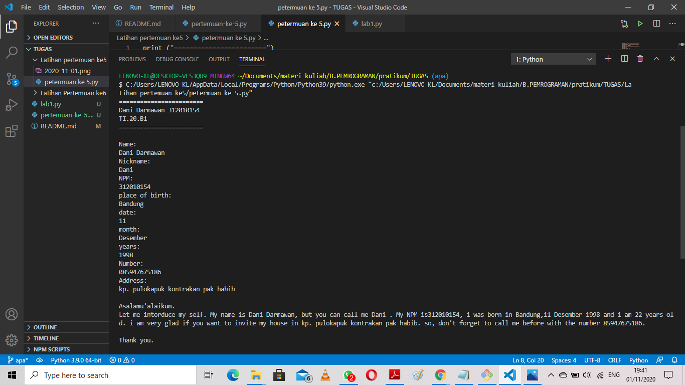
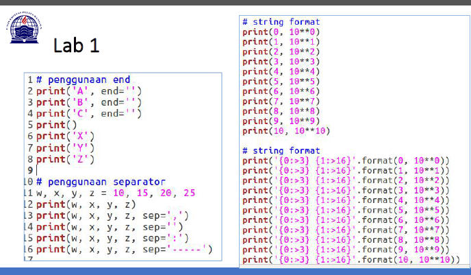
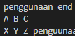
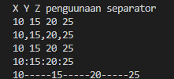
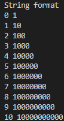
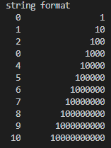
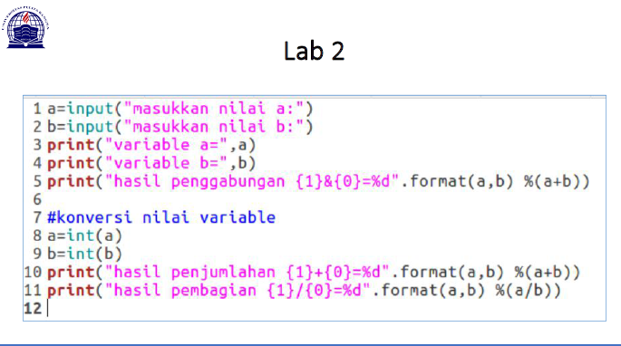

# Tugas pertemuan ke 6
Repository ini digunakan untuk memenuhi Tugas Bahasa Pemrograman - Pertemuan 6

Nama    : Dani Darmawan <br>
NIM     : 312010154 <br>
KELAS   : TI.20.B1 <br>

### DAFTAR ISI
| NO | DESCRIPTION | LINK |
| ---- | ----- | ----|
| 1 | Tugas Pertemuan 5 | [CLICK HERE](#Latihan-pertemuan-ke-5) |
| 2 | Tugas Pertemuan 6 | [CLICK HERE](#Latihan-pertemuan-ke-6) |

## Latihan-pertemuan-ke-5
Pada pertemuan 5 Bahasa Pemrograman, saya diberi tugas oleh Dosen untuk membuat Aplikasi Biodata dengan Python (Seperti Gambar dibawah ini):

klik link berikut ([Tugas 5 ](pertemuan-ke-5.py)) <br>
``` python

print("Name: ")
Name=input()
print("Nickname: ")
Nickname=input()
print("NPM: ")
Npm=int(input())
print("place of birth: ")
place=input()
print("date: ")
date=int(input())
print("month: ")
month=input()
print("years: ")
year=int(input())
print("Number: ")
Number=int(input())
print("Address: ")
address=input()

age=2020-year


print ("\nAsalamu'alaikum.")
print(f"Let me intorduce my self. My name is {Name}, but you can call me {Nickname} . My NPM is{Npm}, i was born in {place},{date} {month} {year} and i am {age} years old. i am very glad if you want to invite my house in {address}. so, don't forget to call me before with the number {Number}.")
print ("\nThank you.")
```
* berikut penjelasan : <br>
``` python
print("Name: ")

```
source code yang di atas tsb saya gunakan untuk mengahsilkan/output " **Name :** ". <br>
karna string saya tidak menggunakan tanda *petik dua* di dalam fungsi print()

``` python
print("Number: ")
Number=int(input())

```
sedang jika ata menginginkan suatu intrger / angka yang d masukan maka memasukan fungsi int terlebih dahulu <br> yang di input seperti contoh di atas.
*note interger
| ------------------------------------------------------- |
| tidak menggukana tanda *petik dua* dalam fungsi print() |
| jika seperti di bawah ini |
``` python
|print(100000)|
```
hasil dari inputan [di atas](#Latihan-pertemuan-ke-5) 
<br>


## Latihan-pertemuan-ke-6
dalam pertemuan ke 6 ini saya di berikan tugas yaitu: <br>
## lab1
 <br>
ini dia [source_code_nya](lab1.py) <br>
``` python
# penggunaan end
print("penggunaan end")
print("A", end=" ")
print("B", end=" ")
print("C", end=" ")
print("X", end=" ")
print("Y", end=" ")
print("Z", end=" ")

print()
print("X")
print("Y")
print("Z")
```
* fungsi penggunaan **end=" "** sebagai penambahan karakter di akhir<br>
Contoh hasil input di atas yang menggukana fungsi **end=" "**
 <br>

* untunk penggunaan syntax **print()** hanya menghasilkan sebuah output biasa <br>
Contoh Hasil input yang hanya menggunakan perintah **print()** <br>
.jpg) <br>


``` python
# penggunaan separator
print("penguunaan separator")
w, x, y, z = 10, 15, 20, 25
print(w, x, y, z)
print(w, x, y, z, sep=",")
print(w, x, y, z, sep=" ")
print(w, x, y, z, sep=":")
print(w, x, y, z, sep="-----")
```
* sedangkan penggunaan separator berfungsi sebagai pemisah <br>
Hasil dari inputan di atas <br>
 <br>

``` python
# string format (1)
print("String format")
print(0, 10**0)
print(1, 10**1)
print(2, 10**2)
print(3, 10**3)
print(4, 10**4)
print(5, 10**5)
print(6, 10**6)
print(7, 10**7)
print(8, 10**8)
print(9, 10**9)
print(10, 10**10)

# string format (2)
print("string format")
print("{0:>3} {1:>16}".format(0, 10**0))
print("{0:>3} {1:>16}".format(1, 10**1))
print("{0:>3} {1:>16}".format(2, 10**2))
print("{0:>3} {1:>16}".format(0, 10**3))
print("{0:>3} {1:>16}".format(4, 10**4))
print("{0:>3} {1:>16}".format(5, 10**5))
print("{0:>3} {1:>16}".format(6, 10**6))
print("{0:>3} {1:>16}".format(7, 10**7))
print("{0:>3} {1:>16}".format(8, 10**8))
print("{0:>3} {1:>16}".format(9, 10**9))
print("{0:>3} {1:>16}".format(10, 10**10))

```
pada syntax di atas untuk string format(1) menampilkan output dari kanan<br>
sedangkan string format(2) menampilkan dari kiri, hasil seperti di bawah ini<br>
string format(1)            string format(2)
  <br>

## Lab2
 <br>
ini dia [source_code_nya](lab2.py) <br>
``` python
a=int(input("masukan nilai a: "))
b=int(input("masukan nilai b: "))
print("variabel a=",a)
print("variabel b=",b)
print("hasil penggabungan {1} & {0} = %d" . format(a,b) %(a+b))
```
Hasil dari inputan di atas<br>
.png)

``` python
print("\n#konversi nilai variabel")
a=int(a)
b=int(b)
print("hasil penjumlahan {1} + {0} = %d". format(a,b) %(a+b))
print("hasil penjumlahan {1} / {0} = %d". format(a,b) %(a/b))

```
Hasil dari inputan di atas<br>
.png)

* fungsi dari **int()** agar saat di run dan memasukan data hanya berupa angka<br>
Not untuk yang bagian konversi nilai variabel harus memasukan syntax di bwh ini terlebih dahulu<br>
``` python
a=int(input("masukan nilai a: "))
b=int(input("masukan nilai b: "))
